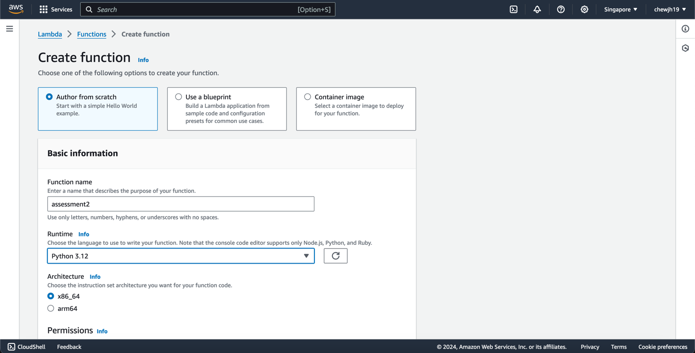
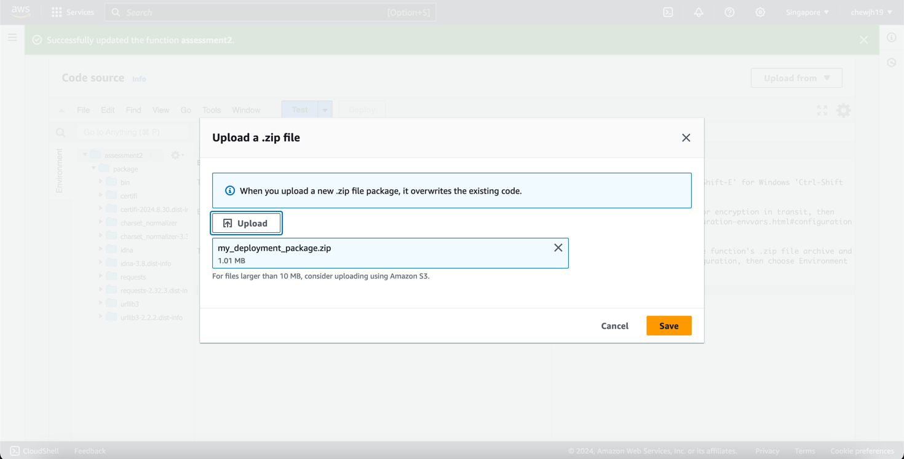
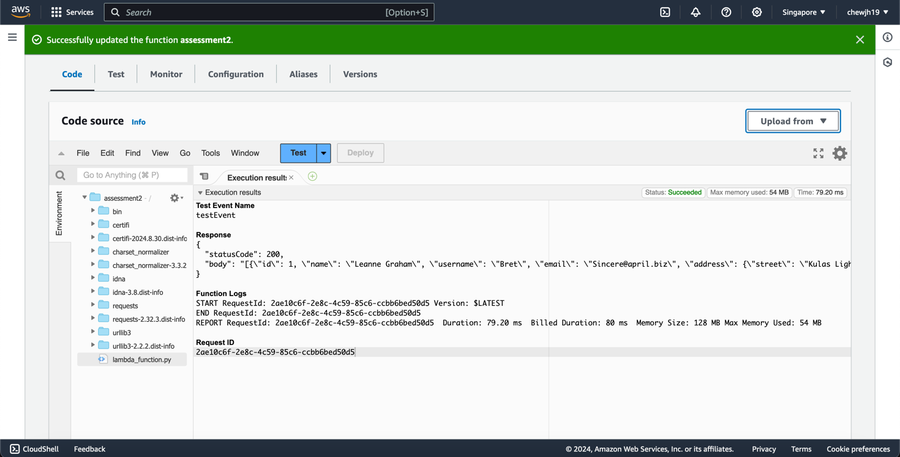

# GovTech Assessment 2

An experiment with AWS Lambda functions.

## Steps
1. Create lambda_function.py
2. As I am using the `requests` library, I have to create a .zip package with the library included.
```bash
mkdir package
pip install requests --target ./package
cd package
zip -r ../my_deployment_package.zip ./
cd ..
zip my_deployment_package.zip lambda_function.py
```
3. I create the lambda function on AWS and upload the zip file


4. Upon running the default hello-world test event, we see that the lambda function works as intended

